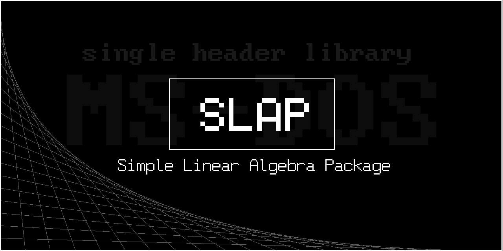

<!--# SLAP
Simple Linear Algebra Package (SLAP) -->


## Features
- Written in `C` for maximum compatibility among various systems
- No external libraries (all-in-one header file)
- Small enough to fit inside **MS-DOS** (and eventually embedded systems)
- Tailored to be used in _Finite Element_ software


# Functions

All the functions that return a matrix allocate new memory for the returned matrix.
| function | operation | math |
| --- | --- | --- |
| `mat_new(n,m)` | allocate memory for $n\times m$ matrix ($n$ rows and $m$ cols); set all values to zero | |
| `mat_free(A)` | free the allocated memory for matrix $\mathbf{A}$ | |
| `mat_set(A,i,j,a)` | set the member of $\mathbf{A}$ at row $i$ and column $j$ equal to $a$ | $A_{ij}=a$ |
| `a = mat_get(A,i,j)` | get the member of $\mathbf{A}$ at row $i$ and column $j$ equal to $a$ | $a=A_{ij}$ |
| `B = mat_copy(A)` | copy the matrix $\mathbf{A}$ into $\mathbf{B}$ allocating memory | |
| `mat_add_r(A,B)` | add matrix $\mathbf{A}$ and $\mathbf{B}$ and put the result in $\mathbf{A}$ (_reference_) | $\mathbf{A}=\mathbf{A}+\mathbf{B}$ |
| `mat_sub_r(A,B)` | subtract matrix $\mathbf{A}$ and $\mathbf{B}$ and put the result in $\mathbf{A}$ (_reference_) | $\mathbf{A}=\mathbf{A}-\mathbf{B}$ |
| `C = mat_add(A,B)` | add matrix $\mathbf{A}$ and $\mathbf{B}$ and put the result in $\mathbf{C}$ | $\mathbf{C}=\mathbf{A}+\mathbf{B}$ |
| `C = mat_sub(A,B)` | subtract matrix $\mathbf{A}$ and $\mathbf{B}$ and put the result in $\mathbf{C}$ | $\mathbf{C}=\mathbf{A}-\mathbf{B}$ |
| `B = mat_smul(A,c)` | scale the matrix $\mathbf{A}$ with the scalar $c$ and put into $\mathbf{C}$ | $\mathbf{B}=c\mathbf{A}$ |
| `mat_smul_r(A,c)` | scale the matrix $\mathbf{A}$ with the scalar $c$ and put into $\mathbf{A}$ (_reference_) | $\mathbf{A}=c\mathbf{A}$ |
| `C = mat_mul(A,B)` | multiply $\mathbf{A}$ and $\mathbf{B}$ and put the result in $\mathbf{C}$; also works with scalar (row times column vector) and tensor (column times row vector) product | $\mathbf{A}=\mathbf{A}\mathbf{B}\quad$  $\mathbf{u}\cdot\mathbf{v}=\mathbf{u}^T\mathbf{v}\quad$   $\mathbf{u}\otimes\mathbf{v}=\mathbf{u}\mathbf{v}^T$ |
| `mat_equal(A,B,tol)` | check if matrix $\mathbf{A}$ and $\mathbf{B}$ are equal | true if $abs(A_{ij}-B_{ij}) < tol$ |
| `B = mat_transpose(A)` | transpose the matrix $\mathbf{A}$ and put into matrix $\mathbf{B}$ | $\mathbf{B}=\mathbf{A}^T$ |
| `mat_transpose_r(A)` | transpose the matrix $\mathbf{A}$ without allocating memory (_reference_) | $\mathbf{A}=\mathbf{A}^T$ |
| `t = mat_trace(A)` | return the trace of $\mathbf{A}$ | $a = tr(\mathbf{A}) = \sum_{i=1}^{min(n,m)} A_{ii}$ |
| `I = mat_eye(n)` | create an $n\times n$ identity matrix | |
| `U = mat_GaussJordan(A)` | transform matrix $\mathbf{A}$ in row echelon form $\mathbf{U}$ (upper triangular) via Gauss elimination | |
| `LUP = mat_lup_solve(A)` | find the LU(P) decomposition of $\mathbf{A}$; $\mathbf{L}$ is a lower triangular, $\mathbf{U}$ an upper triangular and $\mathbf{P}$ a permutation matrix (return a `lup` struct) | $\{\mathbf{L},\mathbf{U},\mathbf{P}\}\gets\mathbf{A}\quad$ $\mathbf{P}\mathbf{A}=\mathbf{L}\mathbf{U}$ |
| `QR = mat_qr_solve(A)` | find the QR decomposition of $\mathbf{A}$; $\mathbf{Q}$ is a orthogonal, $\mathbf{R}$ an upper triangular matrix (return a `qr` struct) | $\{\mathbf{Q},\mathbf{R}\}\gets\mathbf{A}\quad$ $\mathbf{A}=\mathbf{Q}\mathbf{R}$ |
| `a = eigen_qr(A)` | calculate eigenvalues of $\mathbf{A}$ with QR decomposition and put the result in $\mathbf{a}$ | |
| `mat_print(A)` | print matrix $\mathbf{A}$ | |


# Examples

### Matrix creation
```C++
#include "SLAP.h"

void main()
{
	// allocate the matrix structure and set the values:
	mat *A = mat_init(3,3, (double[]){1,2,3,4,5,6,7,8,9});
	printf("A = \n"); mat_print(A); // print the matrix
	
	mat_free(A); // free the allocated memory
}
```

### Multiplication
```C++
#include "SLAP.h"

void main()
{
	mat *A, *I, *u, *v;
	
	A = mat_init(3,3, (double[]){1,2,3,4,5,6,7,8,9});
	I = mat_init(3,3, (double[]){1,0,0,0,1,0,0,0,1}); // identity matrix
	
	// scalar-matrix multiplication:
	mat_print(mat_smul(A, 2.5)); // print 2.5 * A
	
	// vector-vector multiplication:
	u = mat_init(3,1, (double[]){1,2,3}); // column vector
	v = mat_init(3,1, (double[]){2,2,2}); // column vector
	printf("u^T * v =\n"); mat_print(mat_mul(mat_transpose(u), v)); // scalar product
	printf("u * v^T = ");  mat_print(mat_mul(u, mat_transpose(v))); // tensor product
	
	// matrix-vector multiplication:
	mat_print(mat_mul(A,u)); // A * u
	
	// matrix-matrix multiplication:
	mat_print(mat_mul(A,I)); // A * I
	mat_print(mat_mul(A,A)); // A * A
	
	mat_free(A); mat_free(I); mat_free(u); mat_free(v);
}
```

### Solve linear system
```C++
#include "SLAP.h"

void main()
{
	mat *A = mat_init(3,3, (double[]){1,3,3,4,5,6,7,8,9});
	mat *b = mat_init(3,1, (double[]){1,1,1});
	
	printf("A =\n"); mat_print(A);
	printf("b =\n"); mat_print(b);
	printf("Solve  A * x = b  for x\n\n");
	
	printf("LU(P) decomposition:\n");
	mat_lup *lu = mat_lup_solve(A); // LU(P) decomposition of matrix A
	mat* x = solve_lu(lu, b); // solve linear system using LU decomposition
	printf("x =\n"); mat_print(x);
	
	printf("\n\n\nGauss elimination of A:\n");
	print_mat(mat_GaussJordan(A));
	
	mat_free(A); mat_free(b);
}
```

### Eigenvalues / Eigenvectors
```C++
#include "SLAP.h"

void main()
{
	mat *A = mat_init(3,3, (double[]){1,3,3,4,5,6,7,8,9});
	mat_print(eigen_qr(A)); // print eigenvalues using QR decomposition
}
```


# ToDo
<!--  v0.2  to  v0.3  -->
- [ ] **CORE**
	- [ ] BTC++ `mat_init_DOS`
	- [ ] error handling
	- [ ] `push_back()` like `vector<TYPE>` for vectors (column or row matrices)
	- [ ] `__attribute__((cleanup(mat_free)))` prima della definizione delle matrici che devono auto-eliminarsi?
	- [ ] usare `static` davanti a `mat*` di ritorno di alcune funzioni?
	- [ ] `inline void` per `mat_free`?
	- [ ] `const mat*` come arg alle funzioni migliora la gestione della memoria?
- [ ] **BASIC OPERATIONS**
	- [ ] multiplication
		- [ ] cache aligned (for _row-major_)
		- [ ] Strassen
		- [ ] Coppersmith?
	- [x] trace
	- [x] diagonal square matrix from vector
	- [ ] rename `smul` into `scale`?
	- [ ] ...
- [ ] **DECOMPOSITION**
	- [ ] separare l'implementazione di LU e QR dai solver (files separati)
	- [ ] QR
		- [ ] Householder method
		- [ ] Gibs rotations?
	- [ ] Cholesky factorization
	- [ ] Singular Value Decomposition (SVD)
	- [ ] Principal Component Analysis (PCA)
	- [ ] ...
- [ ] **SOLVER**
	- [ ] controllare la stabilità (e la velocità)
	- [ ] LU decomposition
		- [ ] use Cholesky factorialization for positive definite matrix to improve speed
	- [ ] QR decomposition
		- [ ] devo solamente implementare la routine che risolve il sistema
	- [ ] iterative algorithms (for large scale problems)
		- [ ] Jacobi iterative method
		- [ ] Gauss-Seidel iterative method
		- [ ] Successive over Relaxation SOR method
		- [ ] Conjugate gradient
		- [ ] Bi-conjugate gradient
	- [ ] Sparse solvers
		- [ ] conjugate gradient?
		- [ ] preconditioning?
	- [ ] ...
- [ ] **EIGEN**
	- [ ] QR decomposition
		- [ ] definire meglio quando finire la procedura iterativa
		- [ ] forma di Hessenberg per aumentare l'efficienza
		- [ ] implicit QR algorithm?
	- [ ] Iterative power methods
	- [ ] ...
- [ ] **ADVANCED OPERATIONS**
	- [ ] determinant
		- [ ] LU(P) decomposition (_nml_)
		- [ ] Sviluppo di Laplace
		- [ ] Bareiss algorithm
		- [ ] Division-free algorithm
		- [ ] Fast matrix multiplication
	- [ ] inverse
		- [ ] LU(P) decomposition (_nml_)
		- [ ] matrice aggiunta e determinante
	- [ ] positive defined check
		- [ ] Eigenvalues?
	- [ ] matrix distances
	- [ ] exponent
	- [ ] least squares
	- [ ] order of a matrix
	- [x] vector product `vec3 * vec3`
	- [ ] conjugate matrix
	- [ ] Hessenberg form
	- [ ] Vandermonde, Hankel, etc.
	- [ ] Jacobian
	- [ ] Hessian
	- [ ] FFT
	- [ ] _Control systems methods_
	- [ ] ...
- [ ] **UTILS**
	- [ ] random number generator
		- [ ] sample from gaussian distribution
	- [ ] complex matrices
	- [ ] ...

<!--
- [ ] **SOLVER**
	- [ ] iterative algorithms (for large scale problems)
		- [ ] preconditioned conjugate gradients (`pcg`)
		- [ ] least squares (`lsqr`)
		- [ ] minimum residual (`minres`)
		- [ ] symmetric LQ (`symmlq`)
		- [ ] biconjugate gradient (`bicg`)
		- [ ] biconjugate gradient stabilized (`bicgstab`)
		- [ ] conjugate gradient squared (`cgs`)
		- [ ] generalized minimum residual (`gmres`)
		- [ ] quasi-minimal residual (`qmr`)
		- [ ] transpose-free quasi-minimal residual (`tfqmr`)
-->
