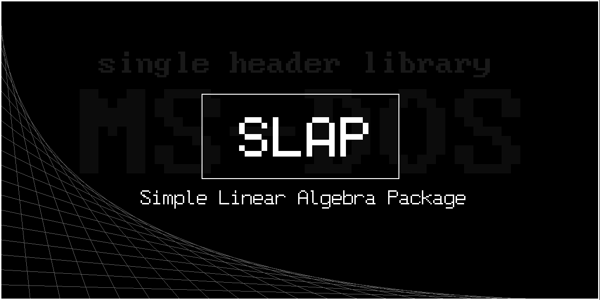

<!--# SLAP
Simple Linear Algebra Package (SLAP) -->


## Features
- Written in `C` for maximum compatibility among various systems
- No external libraries (all-in-one header file)
- Small enough to fit inside **MS-DOS** (and eventually embedded systems)
- Tailored to be used in *Finite Element* and *Machine Learning* softwares


# Functions

All the functions that return a matrix allocate new memory for the returned matrix.
| function | operation | math |
| --- | --- | --- |
| `mat_new(n,m)` | allocate memory for $n\times m$ matrix ($n$ rows and $m$ cols); set all values to zero | |
| `mat_free(A)` | free the allocated memory for matrix $\mathbf{A}$ | |
| `mat_set(A,i,j,a)` | set the member of $\mathbf{A}$ at row $i$ and column $j$ equal to $a$ | $A_{ij}=a$ |
| `a = mat_get(A,i,j)` | get the member of $\mathbf{A}$ at row $i$ and column $j$ | $a=A_{ij}$ |
| `B = mat_copy(A)` | copy the matrix $\mathbf{A}$ into $\mathbf{B}$ allocating memory | |
| `mat_add_r(A,B)` | add matrix $\mathbf{A}$ and $\mathbf{B}$ and put the result in $\mathbf{A}$ (_reference_) | $\mathbf{A}=\mathbf{A}+\mathbf{B}$ |
| `mat_sub_r(A,B)` | subtract matrix $\mathbf{A}$ and $\mathbf{B}$ and put the result in $\mathbf{A}$ (_reference_) | $\mathbf{A}=\mathbf{A}-\mathbf{B}$ |
| `C = mat_add(A,B)` | add matrix $\mathbf{A}$ and $\mathbf{B}$ and put the result in $\mathbf{C}$ | $\mathbf{C}=\mathbf{A}+\mathbf{B}$ |
| `C = mat_sub(A,B)` | subtract matrix $\mathbf{A}$ and $\mathbf{B}$ and put the result in $\mathbf{C}$ | $\mathbf{C}=\mathbf{A}-\mathbf{B}$ |
| `B = mat_scale(A,c)` | scale the matrix $\mathbf{A}$ with the scalar $c$ and put into $\mathbf{C}$ | $\mathbf{B}=c\mathbf{A}$ |
| `mat_scale_r(A,c)` | scale the matrix $\mathbf{A}$ with the scalar $c$ and put into $\mathbf{A}$ (_reference_) | $\mathbf{A}=c\mathbf{A}$ |
| `C = mat_mul(A,B)` | multiply $\mathbf{A}$ and $\mathbf{B}$ and put the result in $\mathbf{C}$; also works with scalar (row times column vector) and tensor (column times row vector) product | $\mathbf{A}=\mathbf{A}\mathbf{B}\quad$  $\mathbf{u}\cdot\mathbf{v}=\mathbf{u}^T\mathbf{v}\quad$   $\mathbf{u}\otimes\mathbf{v}=\mathbf{u}\mathbf{v}^T$ |
| `mat_equal(A,B,tol)` | check if matrix $\mathbf{A}$ and $\mathbf{B}$ are equal | true if $abs(A_{ij}-B_{ij}) < tol$ |
| `B = mat_transpose(A)` | transpose the matrix $\mathbf{A}$ and put into matrix $\mathbf{B}$ | $\mathbf{B}=\mathbf{A}^T$ |
| `mat_transpose_r(A)` | transpose the matrix $\mathbf{A}$ without allocating memory (_reference_) | $\mathbf{A}=\mathbf{A}^T$ |
| `t = mat_trace(A)` | return the trace of $\mathbf{A}$ | $a = tr(\mathbf{A}) = \sum_{i=1}^{min(n,m)} A_{ii}$ |
| `I = mat_eye(n)` | create an $n\times n$ identity matrix | |
| `U = mat_GaussJordan(A)` | transform matrix $\mathbf{A}$ in row echelon form $\mathbf{U}$ (upper triangular) via Gauss elimination | |
| `LUP = mat_lup_solve(A)` | find the LU(P) decomposition of $\mathbf{A}$; $\mathbf{L}$ is a lower triangular, $\mathbf{U}$ an upper triangular and $\mathbf{P}$ a permutation matrix (return a `lup` struct) | $\{\mathbf{L},\mathbf{U},\mathbf{P}\}\gets\mathbf{A}\quad$ $\mathbf{P}\mathbf{A}=\mathbf{L}\mathbf{U}$ |
| `QR = mat_qr_solve(A)` | find the QR decomposition of $\mathbf{A}$; $\mathbf{Q}$ is a orthogonal, $\mathbf{R}$ an upper triangular matrix (return a `qr` struct) | $\{\mathbf{Q},\mathbf{R}\}\gets\mathbf{A}\quad$ $\mathbf{A}=\mathbf{Q}\mathbf{R}$ |
| `a = eigen_qr(A,tol,max_iter)` | calculate eigenvalues of $\mathbf{A}$ with QR decomposition and put the result in $\mathbf{a}$. Approximate the solution between tolerance `tol` and maximum number of steps `max_iter` | |
| `a = eigen_power_method(A,eigv,tol,max_iter)` | calculate eigenvalues of $\mathbf{A}$ with power iteration method and put the result in $\mathbf{a}$. Evaluates also eigenvector `eigv`. Approximate the solution between tolerance `tol` and maximum number of steps `max_iter` | |
| `mat_print(A)` | print matrix $\mathbf{A}$ | |


# Examples

### Matrix creation
```C++
#include "SLAP.h"

void main()
{
	// allocate the matrix structure and set the values:
	mat *A = mat_init(3,3, (double[]){1,2,3,4,5,6,7,8,9});
	printf("A = \n"); mat_print(A); // print the matrix
	
	mat_free(A); // free the allocated memory
}
```

### Multiplication
```C++
#include "SLAP.h"

void main()
{
	mat *A, *I, *u, *v;
	
	A = mat_init(3,3, (double[]){1,2,3,4,5,6,7,8,9});
	I = mat_init(3,3, (double[]){1,0,0,0,1,0,0,0,1}); // identity matrix
	
	// scalar-matrix multiplication:
	mat_print(mat_smul(A, 2.5)); // print 2.5 * A
	
	// vector-vector multiplication:
	u = mat_init(3,1, (double[]){1,2,3}); // column vector
	v = mat_init(3,1, (double[]){2,2,2}); // column vector
	printf("u^T * v =\n"); mat_print(mat_mul(mat_transpose(u), v)); // scalar product
	printf("u * v^T = ");  mat_print(mat_mul(u, mat_transpose(v))); // tensor product
	
	// matrix-vector multiplication:
	mat_print(mat_mul(A,u)); // A * u
	
	// matrix-matrix multiplication:
	mat_print(mat_mul(A,I)); // A * I
	mat_print(mat_mul(A,A)); // A * A
	
	mat_free(A); mat_free(I); mat_free(u); mat_free(v);
}
```

### Solve linear system
```C++
#include "SLAP.h"

void main()
{
	mat *A = mat_init(3,3, (TYPE[]){1,3,3,4,5,6,7,8,9});
	mat *b = mat_init(3,1, (TYPE[]){1,1,1});
	
	printf("A =\n"); mat_print(A);
	printf("b =\n"); mat_print(b);
	printf("Solve  A * x = b  for x\n\n");
	
	printf("LU(P) decomposition:\n");
	mat_lup *lu = mat_lup_solve(A); // LU(P) decomposition of matrix A
	mat* x = solve_lu(lu, b); // solve linear system using LU decomposition
	printf("x =\n"); mat_print(x);
	
	printf("\n\n\nGauss elimination of A:\n");
	print_mat(mat_GaussJordan(A));
	
	mat_free(A); mat_free(b);
}
```

### Eigenvalues / Eigenvectors
```C++
#include "SLAP.h"

void main()
{
	mat *A = mat_init(3,3, (double[]){1,3,3,4,5,6,7,8,9});
	mat_print(eigen_qr(A)); // print eigenvalues using QR decomposition
}
```


# ToDo
<!--  v0.2  to  v0.3  -->
- [ ] seguire il *Semantic Versioning* (semver.org)
- [ ] **CORE**
	- [ ] BTC++ `mat_init_DOS`
	- [ ] error handling <!-- Creerei una variabile globale int slap_errno; (simile allo standard errno del C) con una enum di codici di errore (SLAP_ERR_MEM, SLAP_ERR_DIM, SLAP_ERR_SINGULAR). Se una funzione fallisce, setta slap_errno e ritorna NULL. L'utente deciderà se e come crashare. -->
	- [ ] `push_back()` like `vector<TYPE>` for vectors (column or row matrices)
	- [ ] `__attribute__((cleanup(mat_free)))` prima della definizione delle matrici che devono auto-eliminarsi? (NON COMPATIBILE CON DOS)
	- [ ] usare `static` davanti a `mat*` di ritorno di alcune funzioni? (Gemini dice di NO) <!-- In C, restituire un puntatore a una variabile static locale la rende un "Singleton" condiviso. Se chiami la funzione due volte, la seconda chiamata sovrascriverà i dati della prima. Questo distrugge la riusabilità e rende la libreria non thread-safe. Le matrici vanno allocate con malloc/calloc e restituite normalmente. -->
	- [ ] `inline void` per `mat_free`? Inutile. <!-- Inutile. L'istruzione inline suggerisce al compilatore di eliminare l'overhead della chiamata a funzione. Ma dentro mat_free tu chiami free(), che è un'operazione del sistema operativo molto più lenta dell'overhead della funzione. Usalo per funzioni piccolissime e chiamate milioni di volte, come mat_get(m, r, c) o mat_set(m, r, c, val). -->
	- [x] `const mat*` come arg alle funzioni migliora la gestione della memoria? <!-- SÌ, ASSOLUTAMENTE. La Const Correctness è una best practice fondamentale. Scrivere mat_print(const mat* m) o mat_add(const mat* a, const mat* b) fa due cose magiche:
	- Impedisce a te (autore) di modificare per sbaglio una matrice di input.
	- Permette al compilatore di fare ottimizzazioni aggressive, sapendo che quei dati in memoria non cambieranno. -->
- [ ] **BASIC OPERATIONS**
	- [ ] multiplication
		- [x] cache aligned (for _row-major_)
		- [ ] Strassen <!--L'algoritmo di Strassen riduce la complessità da $O(n^3)$ a $O(n^{2.81})$. È un ottimo esercizio, ma attenzione: per via dell'overhead ricorsivo e delle allocazioni necessarie, Strassen è più lento della moltiplicazione base per matrici piccole. Di solito si usa una soglia: se $N < 64$ si usa la base, se $N \ge 64$ si attiva Strassen. Su MS-DOS: La ricorsione profonda potrebbe saturare rapidamente il piccolissimo Stack dei sistemi a 16-bit.-->
		- [ ] Coppersmith? <!--  L'algoritmo di Coppersmith-Winograd (e i suoi successori) sono noti come Galactic Algorithms. Hanno una complessità asintotica migliore ($O(n^{2.37})$), ma le costanti nascoste sono così mostruosamente enormi che diventano più veloci di Strassen solo su matrici le cui dimensioni superano la memoria RAM esistente sul pianeta Terra. Nessuna libreria reale al mondo (nemmeno OpenBLAS o MKL) li usa. -->
	- [x] Hadamard product
	- [x] trace
	- [x] diagonal square matrix from vector
	- [x] rename `smul` into `scale`
	- [ ] ...
- [ ] **DECOMPOSITION**
	- [ ] separare l'implementazione di LU e QR dai solver (files separati) <!-- In DOS, la dimensione dell'eseguibile conta. Se tengo LU, QR, ed EIGEN in file separati (es. slap_lu.c, slap_qr.c), il linker di Borland includerà nell'eseguibile finale solo le funzioni che l'utente chiama effettivamente, risparmiando preziosi Kilobyte. -->
	- [ ] QR
		- [ ] Householder method <!-- numericamente superiore a MGS (Gram-Schmidt modificato) -->
		- [ ] Gibs rotations? Rotazioni di Givens? <!-- Sono eccellenti per annullare singoli elementi (utili per matrici sparse o a banda), ma per matrici dense piene, Householder richiede meno operazioni matematiche (Flops). -->
	- [ ] Cholesky factorization <!-- Assolutamente da aggiungere. Se una matrice è Simmetrica e Definita Positiva (SPD), Cholesky (A=LLT) è grande il doppio più veloce della fattorizzazione LU e usa metà della memoria. Il codice C per Cholesky richiede a malapena 15 righe -->
	- [ ] Singular Value Decomposition (SVD) <!-- Solitamente si riduce la matrice a forma bidiagonale (con Householder) e poi si applica un algoritmo QR iterativo implicito. Richiede molta memoria allocata per matrici di grosse dimensioni. La PCA invece sarà un gioco da ragazzi una volta che avrai un calcolatore affidabile di autovalori/autovettori o SVD (basta centrare i dati e calcolare la decomposizione). -->
	- [ ] Principal Component Analysis (PCA)
	- [ ] ...
- [ ] **SOLVER**
	- [ ] controllare la stabilità (e la velocità)
	- [ ] LU decomposition
		- [ ] use Cholesky factorialization for positive definite matrix to improve speed
	- [ ] QR decomposition
		- [ ] devo solamente implementare la routine che risolve il sistema
	- [ ] iterative algorithms (for large scale problems)
		- [ ] Jacobi iterative method
		- [ ] Gauss-Seidel iterative method
		- [ ] Successive over Relaxation SOR method
		- [x] Conjugate gradient
			- [x] Fix for 3x3 example (2x2 works)
		- [ ] Bi-conjugate gradient
	- [ ] Sparse solvers
		- [ ] conjugate gradient?
		- [ ] preconditioning?
	- [ ] ...
- [ ] **EIGEN**
	- [ ] QR decomposition
		- [x] definire meglio quando finire la procedura iterativa
		- [ ] valori di default per tolleranza e massimo numero di iterazioni
		- [ ] forma di Hessenberg per aumentare l'efficienza <!-- Prima di avviare il ciclo QR, usa Householder per ridurre la matrice originale in forma di Hessenberg superiore (zeri sotto la prima sotto-diagonale). Una matrice di Hessenberg conserva questa forma attraverso le iterazioni QR, abbassando il costo iterativo da O(n^4) a O(n^3) -->
		- [ ] implicit QR algorithm? <!-- Se non implementi uno "Shift" (es. Wilkinson Shift), l'algoritmo QR standard potrebbe convergere così lentamente da sembrare bloccato. Sottraendo una costante sI prima di QR accelera enormemente la convergenza. -->
	- [x] Iterative power methods
	- [ ] ...
- [ ] **ADVANCED OPERATIONS**
	- [ ] determinant
		- [x] LU(P) decomposition (_nml_)
		- [ ] Sviluppo di Laplace
		- [ ] Bareiss algorithm
		- [ ] Division-free algorithm
		- [ ] Fast matrix multiplication
	- [ ] inverse
		- [x] LU(P) decomposition (_nml_)
		- [ ] matrice aggiunta e determinante <!-- matrice aggiunta scala malissimo, con fattoriale O(N!) o O(N^4) -->
	- [ ] positive defined check
		- [ ] Eigenvalues? <!-- in realta' e' lento in questo modo. Usare altri metodi -->
		- [ ] Cholesky
	- [x] matrix norms
	- [ ] exponent
	- [ ] least squares (_example_)
	- [ ] order of a matrix
	- [x] vector product `vec3 * vec3`
	- [ ] conjugate matrix
	- [ ] Hessenberg form
	- [ ] Vandermonde, Hankel, etc.
	- [ ] Jacobian
	- [ ] Hessian
	- [ ] FFT
	- [ ] _Control systems methods_
	- [ ] ...
- [ ] **UTILS**
	- [ ] random number generator
		- [ ] simple mod-type pseudo-random generator
   		- [ ] sample from gaussian distribution
	- [ ] complex matrices
	- [ ] ...

<!--
- [ ] **SOLVER**
	- [ ] iterative algorithms (for large scale problems)
		- [ ] preconditioned conjugate gradients (`pcg`)
		- [ ] least squares (`lsqr`)
		- [ ] minimum residual (`minres`)
		- [ ] symmetric LQ (`symmlq`)
		- [ ] biconjugate gradient (`bicg`)
		- [ ] biconjugate gradient stabilized (`bicgstab`)
		- [ ] conjugate gradient squared (`cgs`)
		- [ ] generalized minimum residual (`gmres`)
		- [ ] quasi-minimal residual (`qmr`)
		- [ ] transpose-free quasi-minimal residual (`tfqmr`)
-->
